# README

## Abstract

Master-Slave synchronous control robotic arm system.

Adopted a new controlling structure,Master-Slave synchronous control,refer to film *Pacific Rim* and *Avatar*.

This robotic arm system have six joint made by BUS servo and Mechanical structure components.

## Overall Architecture

## Key Techonology

master-slave control architecture

High Real-Time Chained Task Scheduling Based on FreeRTOS

High-priority task scheduling triggered by external hardware interrupts

Chained task triggering scheduling

Multi-Bus Coordination  Based on High-Speed Memory Block Copy

Initial State Alignment and Dead-Zone Nonlinear Filtering Based on Finite State Machines

Time-Division Multiplexed Joint Position Data Transmission Protocol

Real-Time Task Performance Analysis Based on GPIO

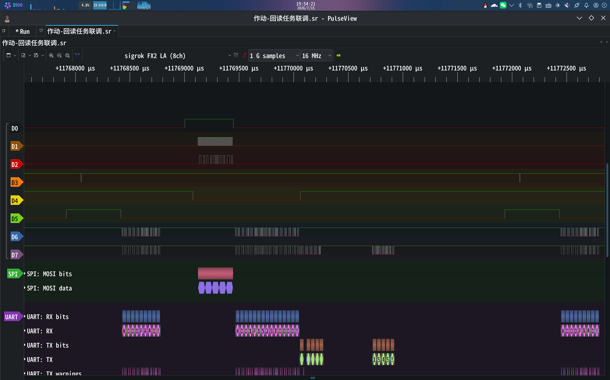

Hardware microsecond-level precise delay

## System Inplementation

### Sensor Layer

The sensing layer uses six bus servos to form a protocol-based UART bus sensor network. The main MCU polls by sending commands to read the current position, and then receives the values returned by the bus servos.

### Transmit Layer

When the host MCU receives position data returned from the bus servos, it extracts the joint address and position, creates a data packet made up of five bytes, and sends it to the slave MCU via the SPI protocol. The host's SPI chip select is controlled by software, meaning it manually toggles the specified chip select pin on the host MCU to trigger the slave MCU to receive the data packet on the SPI bus, ensuring that the host’s sending and the slave’s receiving happen in sync. Once the slave receives the data packet from the host, it extracts the joint address and the corresponding position from it.

### Controll Layer

After the slave MCU extracts the joint address and corresponding position from the data packet, it generates an actuation command based on this information and sends it over the UART bus network to the specified joint for execution. Immediately afterward, the slave MCU sends a command to read the position from the arm joints to achieve position feedback.  

We split the operations of receiving, parsing, and sending actuation commands as well as providing feedback on the actual joint positions into two FreeRTOS tasks. Task scheduling is managed using hardware external interrupts and chain-trigger techniques between tasks. The actuation task is a high-priority task and is assigned a hardware external interrupt pin, which is connected to the host’s SPI chip-select enable pin. When the host sends a chip-select signal via the SPI pin, the external interrupt pin is pulled low, triggering the actuation task. The slave then starts SPI reception, generates the actuation command, and sends it. When the actuation task finishes, it sets a process flag osThreadFlags to trigger the execution of the position feedback task. After the position feedback task completes, the system moves on to the next task scheduling cycle.

### Development and Debug

#### Environment

Operating System: Fedora Linux 44  
Programming Environment: Microsoft VS Code + STM32CubeIDE for Visual Studio Code plugin  
Compiler: arm-none-eabi-gcc (GNU Arm Embedded Toolchain 10.3-2021.10)  
Flashing & Debugger: DAPLink + OpenOCD 0.12.0  
Pin Definitions & Initialization Code Generation: STM32CubeMX 6.18.0

#### Debug

Real-time Task Performance Analysis Based on GPIO: 
To observe and debug the timing of system operations and task scheduling, we used GPIO-based real-time task performance analysis. We set up task scheduling indicator pins for each task: pulling the corresponding pin low when a task starts and restoring it when the task ends. By connecting these indicator pins to a logic analyzer, we can visually see the task scheduling and operation timing on the Pulseview software on a PC, monitor the time consumption of each operation, and also use Pulseview's built-in decoder to analyze signal integrity across different signal paths.

## Component Introduce

**Bus Servo ** 
    Zonling Technology ZP25S and ZP25D bus servos  

**Master-Slave MCU  **
    STM32F407ZGT6 development board  

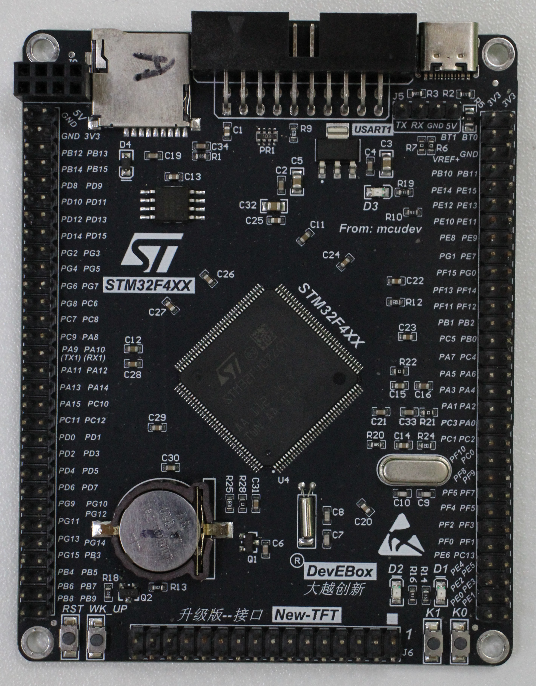

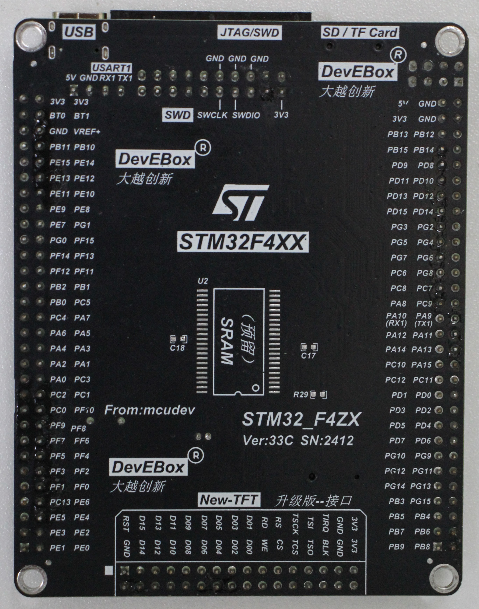

**Servo Driver ** 
    ZLink bus servo driver module

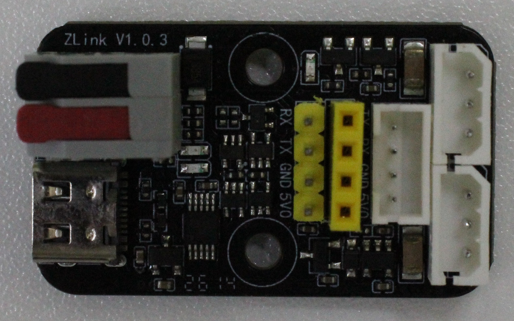

**Programmer/debugger  **
    DAPLink  

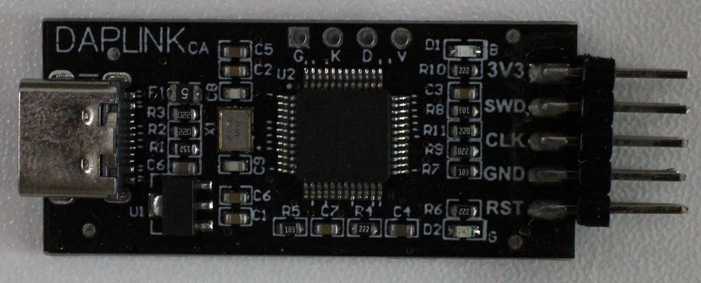

**Logic Analyzer**  
    nanoDLA 8-channel  

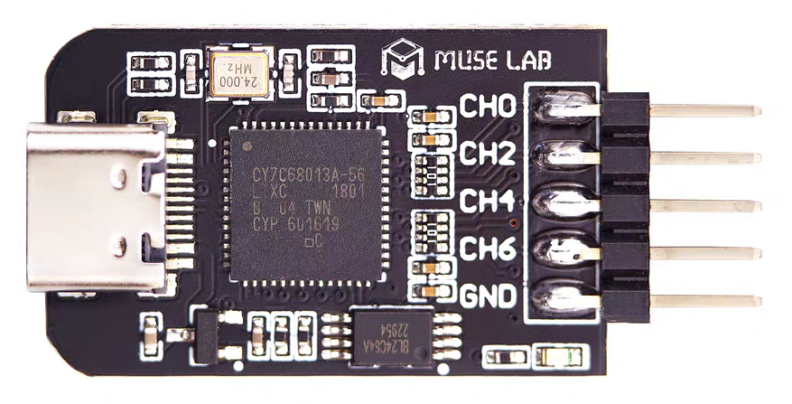

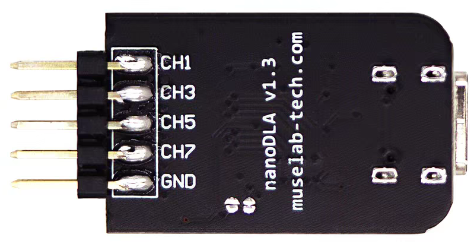

**DC Regulated Power Supply ** 
    Maisheng MN-3010F  

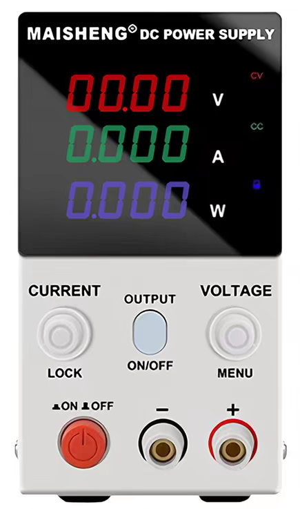

**Structural Components  **
    Aluminum alloy sandblasted sheet metal components,         aluminum alloy CNC servo horns

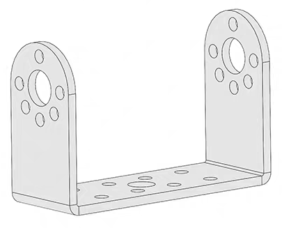

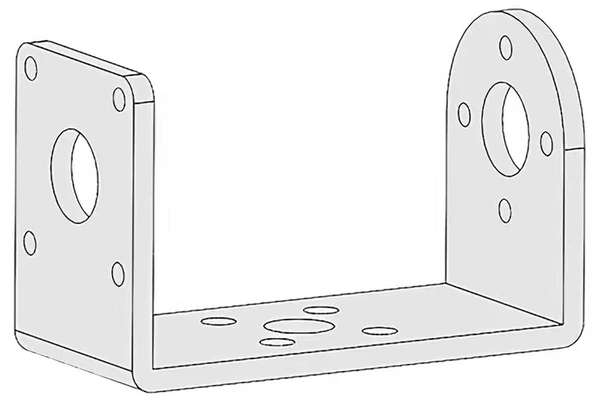

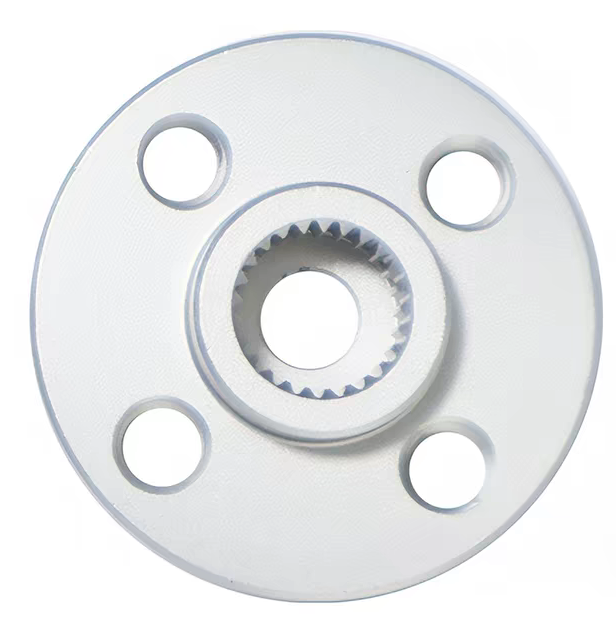

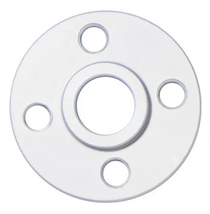

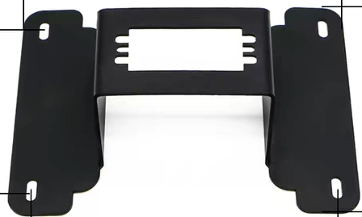

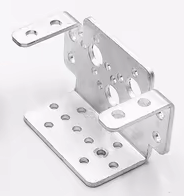
