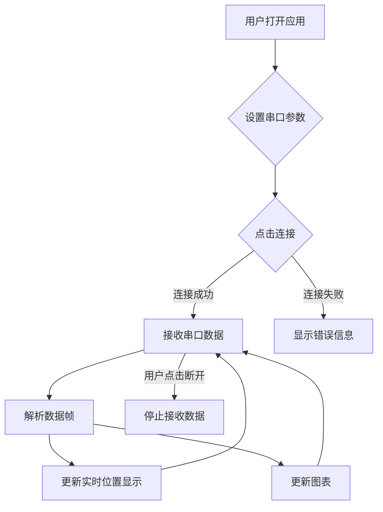

## 1. 产品概述
这是一个用于控制机械臂的桌面UI应用，旨在通过串口通信实时显示机械臂的位置数据、提供串口参数设置、连接控制以及实时数据图表展示。
- 主要目的是提供一个直观的界面，方便用户监控和控制机械臂。
- 产品的目标用户是需要进行机械臂调试和数据监控的工程师或研究人员。

## 2. 核心功能

### 2.1 用户角色
（不适用，此应用无用户角色区分）

### 2.2 功能模块
1.  **主页**: 串口设置区域、数据实时显示区域、连接控制按钮、数据图表展示区域。

### 2.3 页面详情
| 页面名称 | 模块名称 | 功能描述 |
|---|---|---|
| 主页 | 串口设置 | 用户可以选择串口通道（例如：COM1, /dev/ttyUSB0），设置波特率（例如：9600, 115200）。 |
| 主页 | 数据显示 | 六个独立的文本框，分别实时显示来自串口的六个机械臂（或轴）的位置数据。 |
| 主页 | 连接控制 | 一个“连接”按钮，用于建立串口连接；连接成功后按钮变为“断开”，用于关闭串口连接。 |
| 主页 | 图表显示 | 一个绘图区域，用于实时绘制机械臂位置数据的折线图，展示历史数据趋势。 |

## 3. 核心流程
用户打开应用后，首先在串口设置区域选择合适的串口通道和波特率。
点击“连接”按钮后，应用尝试与指定串口建立连接。
如果连接成功，应用开始从串口接收数据。接收到的数据帧格式为五位，第一位是编号（1-6），后四位是实时位置。
应用解析数据帧，将对应编号的实时位置更新到六个文本框中的相应位置，并同时将这些实时位置数据添加到图表中进行绘制。
用户可以随时点击“断开”按钮来终止串口连接和数据接收。

## 4. 用户界面设计
### 4.1 设计风格
- 主要颜色: 青色 (#00BCD4), 蓝色 (#2196F3)。
- 按钮风格: 扁平化设计，带有圆角，点击时有轻微的反馈效果。
- 字体和大小: 选用简洁易读的系统默认字体，数据实时显示框内的字体稍大，以便清晰查看。
- 布局风格: 采用左右分栏布局，左侧放置串口设置和连接控制模块，右侧放置六个数据显示框和图表区域。整体布局简洁，功能区域划分明确。
- 图标/表情风格建议: 使用现代、简洁的线性图标，例如连接图标、断开图标等，无需表情符号。

### 4.2 页面设计概览
| 页面名称 | 模块名称 | UI 元素 |
|---|---|---|
| 主页 | 串口设置 | 串口通道下拉选择器、波特率输入框、标签、边框（分组）。 |
| 主页 | 数据显示 | 六个只读文本框（或标签），每个文本框前有对应的编号标签，例如“位置1:”。 |
| 主页 | 连接控制 | “连接”按钮、“断开”按钮（连接状态切换）。 |
| 主页 | 图表显示 | 一个可动态更新的折线图组件，显示六路数据的实时趋势。 |

### 4.3 响应式设计
此应用主要面向桌面环境，采用固定窗口大小设计，不考虑响应式布局以适应不同屏幕尺寸，保持界面元素和布局的稳定性。

### 4.4 3D 场景指导
（不适用，此应用无3D场景）
