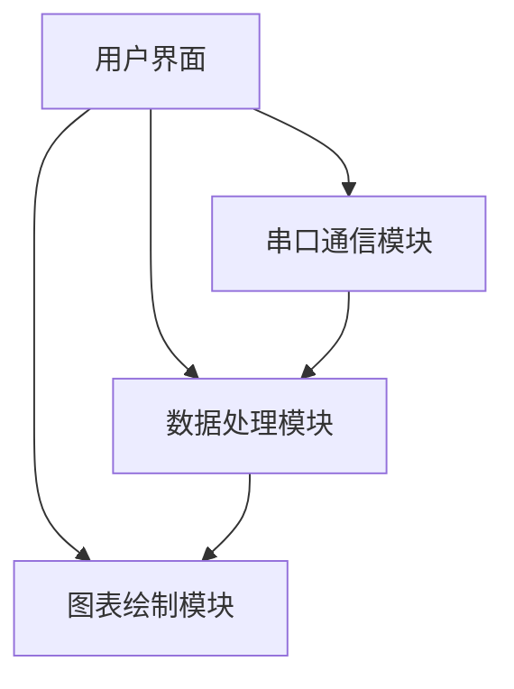
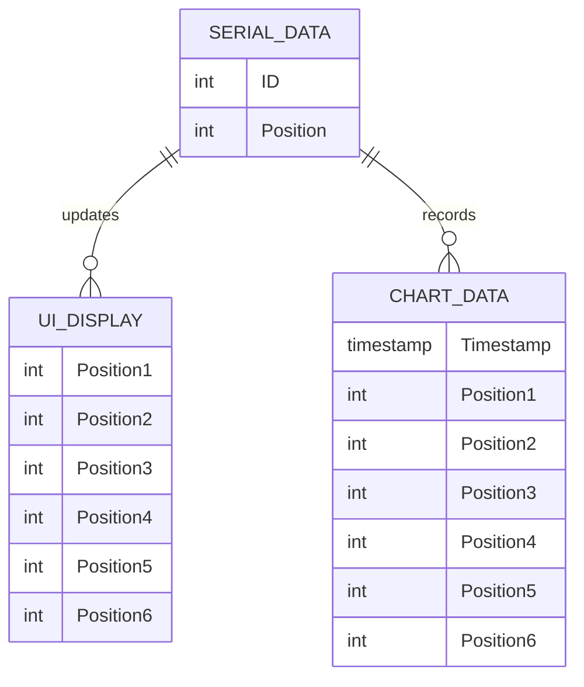

## 1. 架构设计
该应用将是一个独立的桌面GUI应用程序，不涉及后端服务。主要模块包括用户界面、串口通信、数据处理和图表绘制。

## 2. 技术栈描述
- **前端/GUI框架**: Python `tkinter` (基于用户提供的初始代码)
- **串口通信库**: `pyserial`
- **图表绘制库**: `matplotlib`

## 3. 路由定义
（不适用，桌面应用无路由）

## 4. API 定义
（不适用，无后端API）

## 5. 服务器架构图
（不适用，无服务器）

## 6. 数据模型
### 6.1 数据模型定义
- **串口数据帧格式**: 5位字符，第一位为编号（1-6），后四位为实时位置数据。
- **UI显示数据**: 6个独立的实时位置数据。
- **图表数据**: 6个实时位置数据随时间变化的序列。

### 6.2 数据定义语言
（不适用，无数据库）
